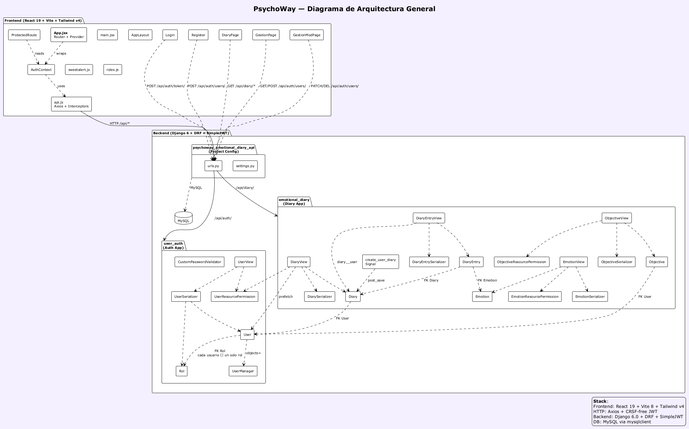
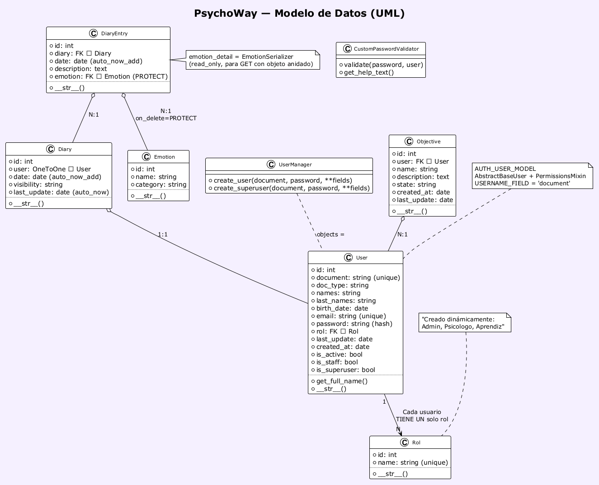
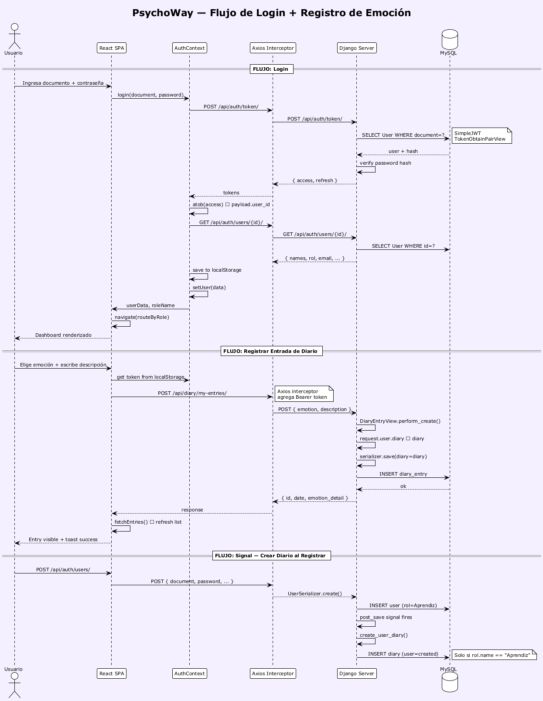
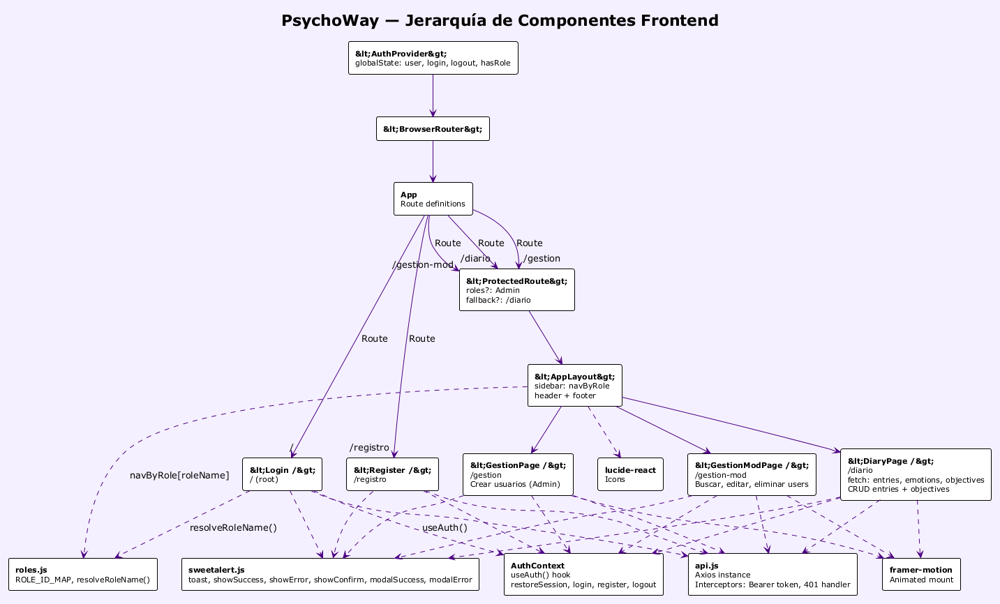

# PsychoWay — Diario de Emociones

Plataforma para el registro y seguimiento de emociones con roles de usuario (Aprendiz, Psicólogo, Administrador). Backend en Django REST Framework + Frontend en React con Vite.

## Stack

| Capa | Tecnología |
|------|-----------|
| **Backend** | Python 3.13, Django 6.0, Django REST Framework |
| **Autenticación** | JWT (SimpleJWT) — access token 60min, refresh 1 día |
| **Base de datos** | MySQL |
| **Frontend** | React 19, Vite 8, Tailwind CSS v4 |
| **Librerías clave** | Axios, framer-motion, lucide-react, react-router-dom v7 |

## Arquitectura

### Modelo en Capas (Layered Architecture)

La app sigue una **Full-stack Monolith**: un monolito backend con frontend SPA desacoplado, comunicación REST API.

**Backend (Django REST Framework):**
```
HTTP Request (JSON)
    ↓
urls.py              → Front Controller (Router)
    ↓
views.py             → Controller (lógica de negocio + orquestación)
    ↓
serializer.py        → DTO (transformación modelo ↔ JSON)
    ↓
permissions.py       → Strategy (seguridad por rol)
    ↓
models.py            → Repository/ORM (abstracción de datos)
    ↓
Base de datos (MySQL)
```

**Frontend (React):**
```
BrowserRouter        → Front Controller
    ↓
Pages                → Containers (estado + lógica de UI)
    ↓
Layouts/Components   → Presentacionales (solo render)
    ↓
Services (api.js)    → Service Layer (HTTP + interceptores)
    ↓
Backend API (REST)
```

No hay microservicios, no hay SSR, no hay BFF. Es el approach más clásico y directo para una web app moderna.



```
diario-emociones/
├── psychoway_emotional_diary_api/   # Config Django (settings, urls raíz)
├── user_auth/                       # App de usuarios y autenticación
│   ├── models.py                    # User (AbstractBaseUser), Rol
│   ├── serializer.py                # UserSerializer con lógica de roles
│   ├── permissions.py               # UserResourcePermission
│   └── views.py                     # UserView (CRUD completo)
├── emotional_diary/                 # App del diario emocional
│   ├── models.py                    # Diary, Emotion, DiaryEntry, Objective
│   ├── serializer.py                # Serializers con emotion_detail anidado
│   ├── permissions.py               # Permisos por rol
│   └── views.py                     # CRUD con filtrado por usuario/rol
└── frontend/                        # React + Vite
    └── src/
        ├── components/              # ProtectedRoute (guard de rutas)
        ├── config/                  # roles.js (mapeo ID → nombre de rol)
        ├── context/                 # AuthContext (login, JWT, sesión)
        ├── layouts/                 # AppLayout (navbar, sidebar por rol, footer)
        ├── pages/                   # Login, Register, Diary, Gestion, GestionMod
        └── services/                # api.js (Axios con interceptors JWT)
```

## Modelo de Datos



```
User "1" ──── "N" Rol         (Cada usuario TIENE UN solo rol)
User "1" ──── "1" Diary       (Un usuario tiene un único diario)
Diary "1" ──── "N" DiaryEntry (Un diario tiene muchas entradas)
Emotion "1" ──── "N" DiaryEntry (Protegido: on_delete=PROTECT)
User "1" ──── "N" Objective   (Cada usuario tiene muchos objetivos)
```

**Detalles clave del modelo:**
- `User` extiende `AbstractBaseUser` + `PermissionsMixin`, login por `document` (no username)
- `Rol` es una entidad separada con `ForeignKey` desde User — un usuario tiene exactamente **un** rol, no puede tener múltiples roles
- `Diary` se crea automáticamente via **signal** `post_save` cuando un usuario con rol `Aprendiz` se registra
- `DiaryEntry` tiene `emotion_detail` como nested serializer (read-only) para que GET devuelva el objeto emoción completo anidado
- `Emotion` usa `on_delete=PROTECT` — no se puede borrar una emoción si hay entradas que la referencian
- Los roles se crean dinámicamente: `Admin` al crear superuser, `Aprendiz` al registrarse un usuario público, `Psicólogo` desde el panel de admin

## Roles del sistema

| Rol | Acceso |
|-----|--------|
| **Administrador** | CRUD de usuarios, gestión completa |
| **Psicólogo** | Visualización de diarios y seguimiento de pacientes |
| **Aprendiz** | Registro de emociones, entradas y objetivos personales |

El frontend resuelve el nombre del rol desde el ID numérico mediante `src/config/roles.js`. Si los IDs no coinciden con tu base de datos, ajustalos ahí.

## Diagramas de Secuencia



Los diagramas muestran:
1. **Login**: cómo el frontend obtiene el JWT, lo decodifica, y recupera los datos del usuario
2. **Registrar entrada**: cómo se crea una entrada de diario con validación de autenticación y asignación automática al diario del usuario
3. **Signal post_save**: cómo se crea automáticamente un `Diary` cuando un nuevo `User` con rol `Aprendiz` se registra

### Flujo de Autenticación (JWT)

```
Login → POST /api/auth/token/ → { access, refresh }
     → Decodificar JWT → user_id
     → GET /api/auth/users/{id}/ → datos del usuario
     → Guardar en localStorage + AuthContext
```

- Axios interceptor agrega `Bearer <token>` a cada request automáticamente
- Otro interceptor captura errores 401 → limpia localStorage → redirige a `/`
- `ProtectedRoute` verifica `isAuthenticated` y opcionalmente `hasRole` para rutas de admin

## Patrones de Diseño

### Backend

| Patrón | Dónde | Explicación |
|--------|-------|-------------|
| **Model-View-Serializer (MVS)** | `models.py` + `views.py` + `serializer.py` | DRF desacopla datos, lógica y representación en 3 capas separadas |
| **Repository (via ORM)** | `get_queryset()` en todas las views | Django ORM abstrae MySQL; las views nunca tocan SQL directo |
| **Strategy** | `permissions.py` (4 clases) | Cada clase de permiso encapsula una estrategia de autorización intercambiable |
| **Observer** | `signals.py` (post_save) | Cuando se crea un User, se dispara la creación automática del Diary |
| **Factory Method** | `UserManager.create_user/superuser` | Encapsula la creación de usuarios con lógica de hash y defaults |
| **DTO (Data Transfer Object)** | `serializer.py` | Serializers transforman modelos ↔ JSON, controlan qué campos se exponen |
| **Template Method** | `ModelViewSet` (perform_create, get_queryset) | DRF define el esqueleto, las subclases implementan pasos concretos |
| **Chain of Responsibility** | `AUTH_PASSWORD_VALIDATORS` | Los validadores de contraseña se ejecutan en cadena |

### Frontend

| Patrón | Dónde | Explicación |
|--------|-------|-------------|
| **Provider / Context** | `AuthContext.jsx` | AuthContext provee estado global de sesión a todo el árbol de componentes |
| **Guard / Protected Routes** | `ProtectedRoute.jsx` | Componente que envuelve rutas y verifica autenticación + rol |
| **Service Layer** | `services/api.js` + `sweetalert.js` | Abstrae la comunicación HTTP y las alertas del UI |
| **Interceptor** | `api.js` (axios interceptors) | Intercepta requests (agrega token JWT) y responses (maneja 401) |
| **Compound Component** | `AppLayout.jsx` | Layout que compone header + sidebar por rol + main + footer |
| **Front Controller** | `App.jsx` + `BrowserRouter` | Router centralizado que dirige todo el tráfico de navegación |
| **Container-Presentational** | pages vs components/layouts | Pages son containers con estado + lógica; layouts/components son presentacionales |

## Sistema de Permisos (RBAC)

Cuatro clases de permisos personalizadas implementan control de acceso basado en roles:

| Permiso | CREATE | READ | UPDATE | DELETE |
|---------|--------|------|--------|--------|
| **Users** | Público | Admin/Psicólogo | Admin/Dueño | Admin/Dueño |
| **Emotions** | Admin/Psicólogo | Autenticado | Admin/Psicólogo | Admin/Psicólogo |
| **Objectives** | Solo Aprendiz | Solo Aprendiz | Solo Dueño | Solo Dueño |
| **Diary** | Solo Admin | Según rol | Solo Admin | Solo Admin |

## Frontend — Jerarquía de Componentes



### Rutas protegidas

| Ruta | Página | Acceso |
|------|--------|--------|
| `/` | Login | Público |
| `/registro` | Registro | Público |
| `/diario` | Diario de emociones | Autenticado |
| `/gestion` | Crear usuarios | Admin |
| `/gestion-mod` | Modificar/Eliminar usuarios | Admin |

La navegación se adapta según el rol del usuario logueado (ver `AppLayout.jsx`):
- **Aprendiz**: Diario de Emociones, Seguimiento, Agenda, Psychobot
- **Psicólogo**: Seguimiento de pacientes, Agenda
- **Admin**: Gestión de Usuarios

## Setup

### Requisitos

- Python 3.13+
- Node.js 20+
- pnpm (o npm/yarn)
- MySQL

### Backend

```bash
# Clonar y entrar
cd diario-emociones

# Entorno virtual
python -m venv .venv
.venv\Scripts\activate    # Windows

# Dependencias
pip install -r requirements.txt

# Variables de entorno — creá un .env en la raíz:
# DB_NAME=psychoway
# USER_DB=root
# PASSWORD_DB=...
# DB_HOST=localhost
# DB_PORT=3306
# JWT_KEY=tu-clave-secreta
# LOCALHOST_FRONT_V1=http://localhost:5173

# Migraciones
python manage.py migrate

# Superusuario
python manage.py createsuperuser

# Servidor
python manage.py runserver
```

### Frontend

```bash
cd frontend

# Dependencias
pnpm install

# Variables de entorno — creá frontend/.env:
# VITE_API_URL=http://127.0.0.1:8000

# Desarrollo
pnpm dev
# → http://localhost:5173
```

## API endpoints

### Autenticación

| Método | Endpoint | Descripción |
|--------|----------|-------------|
| POST | `/api/auth/token/` | Login (document + password) → JWT |
| POST | `/api/auth/token/refresh/` | Refrescar access token |

### Usuarios

| Método | Endpoint | Permiso | Descripción |
|--------|----------|---------|-------------|
| POST | `/api/auth/users/` | Público | Registro (público → rol Aprendiz; admin → cualquier rol) |
| GET | `/api/auth/users/` | Admin/Psicólogo | Listar todos |
| GET | `/api/auth/users/:id/` | Dueño/Admin/Psicólogo | Detalle |
| PUT/PATCH | `/api/auth/users/:id/` | Dueño/Admin | Actualizar |
| DELETE | `/api/auth/users/:id/` | Dueño/Admin | Eliminar |

### Diario emocional

| Método | Endpoint | Descripción |
|--------|----------|-------------|
| GET | `/api/diary/emotions/` | Listar emociones disponibles |
| GET | `/api/diary/my-diary/` | Obtener el diario del usuario |
| GET | `/api/diary/my-entries/` | Entradas del diario (filtradas por rol) |
| POST | `/api/diary/my-entries/` | Crear entrada (`emotion`, `description`, `diary`) |
| GET | `/api/diary/my-objectives/` | Objetivos del usuario |
| POST | `/api/diary/my-objectives/` | Crear objetivo |
| PUT/PATCH | `/api/diary/my-objectives/:id/` | Actualizar objetivo |
| DELETE | `/api/diary/my-objectives/:id/` | Eliminar objetivo |

## Diagramas PlantUML

Los archivos fuente `.puml` están en `docs/`. Para regenerar los PNGs:

```bash
java -jar plantuml.jar -tpng docs/*.puml -o docs
```

## Commits convencionales

```
feat:     Nueva funcionalidad
fix:      Corrección de bug
build:    Cambios en build/dependencias
chore:    Tareas de mantenimiento
docs:     Documentación
```

## Licencia

Proyecto académico — SENA, Análisis y Desarrollo de Software.
